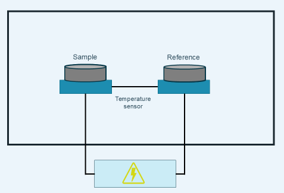
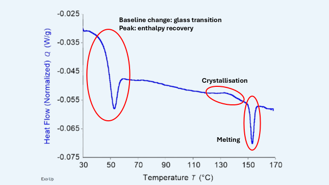
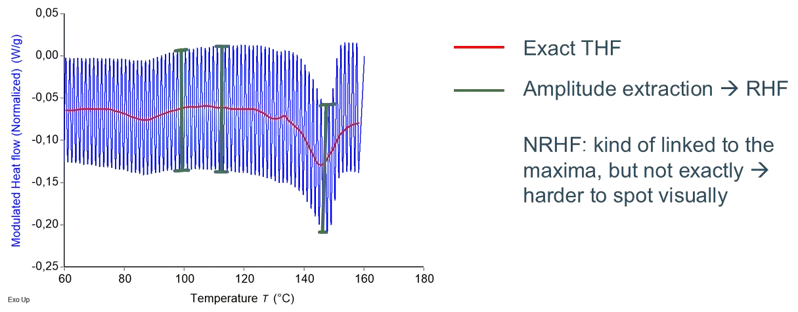

# Tutorial for the overarching app

Welcome to the mDSC analysis software package. If you are not familiar with mDSC, 
we recommend you go to the section about theoretical background first, since the 
following will be technical. This package is intended to help you with:

1. **DSC descriptive statistics**: Quickly calculating averages, standard deviations, 
and relative standard deviations based on mDSC analyses performed in TRIOS®. Thus,
for using this app, your data must already be in specifically formatted Word tables 
and documents.  

2. **Quasi-Isothermal modulated DSC deconvolution**: this type of analysis is not 
always present in all DSC software packages (such as TRIOS®), hence the need for 
a user-friendly app to do this. The input required here is an Excel with your
raw modulated heat flow, modulated temperature, and time. 

3. **Regular modulated DSC deconvolution**: in software packages, this is done by 
using a rolling Fourier transform to extract the amplitude and average of the 
signal. However, in certain cases, this type of deconvolution can lead to artifacts.
This is why it is useful to also calculate the amplitude and average of the signal
based on the maxima and minima in the raw data, without using a Fourier transform.
Moreover, it might be useful to compare this data to unmodulated DSC data, as well
as modulated DSC data that was deconvoluted with a Fourier transform. This package
combines all these features. It package requires an Excel file containing 
temperature, time, and modulated heat flow. 

4. **Modulated DSC deconvolution simulation**: it might be interesting, based on 
events that are already known, to mathematically simulate deconvolution of 
modulated DSC thermograms. This app requires you to already have performed 
modulated DSC on a sample, since inputs such as onset temperatures, midpoint
temperatures, heat capacities, and enthalpies are required. The app uses this
data to construct a modulated heat flow signal, which is subsequently deconvoluted 
into the reversing, total and non-reversing heat flows.

## Theoretical background of DSC and mDSC

Since many parts of the different apps use the same theoretical foundations, a 
theoretical background is given here. It will be referred to as required in the 
different sub-apps.

### Differential scanning calorimetry (DSC)

Differential scanning calorimetry (DSC) is one of the most common methods to 
study the thermal properties of materials. It is of crucial importance in polymer
chemistry and physics, material science, pharmaceutical science, and so forth. 
It allows the user to characterize material properties such as glass transitions,
crystallization and melting events, solvent evaporation, degradation, or any other
detectable event that involves a change in enthalpy or heat capacity. 

A DSC experiment consists of heating two small pans (a pan weight of around 
20-30 mg is most common) from a given temperature to a given temperature at a 
certain heating rate. One of the pans is empty and is called the reference pan.
The other pan contains several milligrams of sample and is referred to as the 
sample pan. As both pans are heated by the furnace (blue blocks in *Figure 1*). 
transitions occur in the sample. This results in a temperature difference,
$\Delta T$ between the sample and reference pans. The total heat flow 
$\frac{dQ}{dt}$, which is the energy flowing to the sample per unit of time, can 
then be derived to be the following:\

$$
\frac{dQ}{dt} = -\frac{\Delta T}{R_r} \quad \quad \quad \quad \text{(Equation 1)}
$$

Where R_r is a resistance term. This simple equation does not consider differences 
in heat capacity between the two furnaces, differences in heat capacity between 
the sample and reference pans, and other instrumental effects. Hence, equations 
that are used to calculate heat flow in DSC are generally more complex. Moreover, 
calibration is always necessary for all DSC instruments to correct for 
instrumental error. Nonetheless, the sample contribution is still fully contained 
in *Equation 1*.

{.center}

**Figure 1.** Basic representation of a differential scanning calorimeter.

The result of a DSC run is a thermogram where heat flow, often normalized for 
sample mass, is generally plotted against temperature. From a thermogram, the
onset, peak (or midpoint in the case of glass transitions), and endset temperatures
of thermal events can be obtained. Moreover, integrating the area under the 
curve of a heat flow versus time (in seconds) thermogram results in the change 
in enthalpy associated with a certain event. An example of a thermogram 
containing a glass transition, an enthalpy recovery, a crystallization event,
and a melting event is shown in *Figure 2*. Further instructions on how to analyze 
and interpret thermograms are not included in this text.

{.center}

**Figure 2.** Typical thermogram resulting from a differential scanning 
calorimetry experiment. Different thermal events are present and highlighted in 
the figure.

The value of the heat flow signal depends on the heating rate. Hence, sometimes, 
the heat capacity is plotted, since it is normalized for heating rate. The 
relationship between heat capacity ($C_p$) and heating rate ($\beta$) is as 
follows when exothermic events are plotted up:

$$
C_p (\frac{J}{°Cg}) = -\frac{\frac{dQ}{dt}(\frac{J}{g s})}{\beta (\frac{°C}{s})} \quad \quad \quad \quad \text{(Equation 2)}
$$

The minus sign here is crucial and must be explained further. If a sample is 
giving off heat (for instance when it is crystallizing), the furnace supplies 
“negative power” and it would make sense for the heat flow to be negative. This
becomes all the more obvious when discussing this in terms of $C_p$. It is 
defined formally, meaning that there is no option for “peak up” or “peak down”. 
For example, there would be a downward $C_p$ peak during crystallization since 
the sample is giving off heat, and so it’s apparent $C_p$ is much lower. There 
is no real choice here when it comes to plotting peaks up or down. Since the 
definition of $C_p$ is clearly defined but $\frac{dQ}{dt}$ can be plotted with 
exotherms either up or down, a minus sign needs to be inserted as a bookkeeping 
quantity when exotherms are plotted up (or in other words, when endotherms are 
plotted down). This is why all thermograms normally mention whether exo is up or
exo is down. For this software package, “exo up” is used for everything going 
forward.

Now that the basics of DSC are clear, it is time to discuss the simple 
temperature program used in unmodulated DSC, since this will paint the picture
for the main differences between modulated (mDSC) and unmodulated DSC (still DSC).
For a DSC analysis, temperature ($T$) can be expressed as follows:
$$
T = T_0 + \beta t \quad \quad \quad \quad \text{(Equation 3)}
$$

where *t* is the time, and *β* is the heating rate. Taking the derivative simply gives:

$$
\frac{dT}{dt} =β \quad \quad \quad \quad \text{(Equation 4)}               
$$

This is a very important difference when comparing to DSC and mDSC, where the temperature program is more complex. 

### Modulated differential scanning calorimetry (mDSC)

First and foremost, all the basics lined out in the previous section about DSC are still valid for mDSC. The only element that varies substantially is the temperature program, which in turn results in an oscillating heat flow signal, called the modulated heat flow (MHF), rather than the simple heat flow that we got for DSC. Interpreting the raw MHF is not very practical, hence why it needs to be deconvoluted. The derivations and steps required for this are discussed in this section. 

The main difference between unmodulated and modulated DSC is that the heating rate is not a constant value. There are different possible heating programs, such as sawtooth modulations, sine wave modulations, and so forth. In the context of this software package, only sine wave modulations are taken into consideration. This means that the temperature can now be written as such: 

$$
 T=T_0+ βt + A_{temp} sin(ωt) 
$$

where A_temp is the temperature modulation amplitude and ω is the frequency. Hence, the derivative of the temperature, namely heating rate, is now:

$$
\frac{dT}{dt} = β+A_{temp} ωcos(ωt)  \quad \quad \quad \quad \text{(Equation 5)}
$$

The cosine wave presented in equation 5 results in a similar oscillation in the heat flow. That is why it is now called the modulated heat flow (MHF) to distinguish it from the other heat flows.

The MHF has two important components, namely its average value (kinetic component) and its amplitude (reversing component). Notice how they are independent: the amplitude of a cosine oscillation says nothing about its average value. For instance, for:

$$
y=Acos(x)+k,
$$

the average value is k while the amplitude is A. In mDSC terms, this is represented as follows: 

$$
\frac{dQ}{dt} =MHF=C_p\frac{dT}{dt} +f(t,T) = C_p A_{temp} ωcos(ωt)  + C_p β + f(t,T)    \quad \quad \quad \quad \text{(Equation 6)}
$$

where the first term is the reversing component, the second term is essentially the baseline, and the third term is the kinetic component. The reversing component is represented by thermal events that happen fast enough to react to the quickly changing modulated temperature. Moreover, these events must be reversible to an extent. Examples are glass transitions and certain types of reversible melting. Reversibility in the context of mDSC is strictly equivalent with thermodynamic reversibility, but they do share similarities. Indeed,  thermodynamically reversible events will show up on the reversing heat flow, but not all events present on the reversing heat flow are strictly thermodynamically reversible. 

In contrast, kinetic phenomena happen too slowly to be seen in the reversing heat flow, which is generated through the quickly changing temperature. In other words, they are time dependent. Moreover, they are temperature dependent as well because they might need a certain activation temperature to occur. Hence, these events are represented by the f(t,T) term in equation 6. Examples are solvent evaporation, enthalpy recovery, melting, and crystallization. 

As was mentioned before, it is desirable to deconvolute the MHF into signals that are easier to interpret. First, the kinetic and baseline components, or the total heat flow (THF), is extracted from the MHF. In other words based on what is stated above, 

$$
THF= 〈\frac{dQ}{dt}〉= C_p β + f(t,T)    \quad \quad \quad \quad \text{(Equation 7)}.
$$

Next, the reversing component, called the reversing heat flow (RHF) , is extracted as such. We equate the two oscillating components from equation 6, namely the (implicit) oscillating component of the MHF and the oscillating component on the right side of equation 6:  

$$
A_{MHF} cos(ωt)= C_p A_{temp} ωcos(ωt).
$$

Isolating $C_p$, we get: 

$$
C_p=\frac{A_{MHF} cos(ωt)}{A_{temp} ωcos(ωt)}. 
$$

Introducing the concepts from equation 2 and using the period $T$ in seconds instead of $ω$ in rad per second: 

$$
RHF= -β \frac{A_{MHF}}{\frac{2π A_{temp}}{T}}  \quad \quad \quad \quad \text{(Equation 8)}
$$

Equation 8 is the general equation to calculate the RHF that is used throughout the software. A_THF is the only parameter to be calculated in this equation, since the rest is all user input. 

It has been stated so far that we must find $〈\frac{dQ}{dt}〉$ and $A_{MHF}$, but not how to do this. An excellent tool for this is the Fourier transform. A complete discussion of the mathematics behind this is outside of the scope of this text. However, it is useful to discuss what it does. Essentially, it generates an amplitude versus frequency graph based on the MHF signal. The amplitude at zero frequency is often called the DC component and is essentially  $〈\frac{dQ}{dt}〉$. The amplitude at the frequency of the modulated temperature signal, related to the value ω that was chosen by the operator, is $A_{MHF}$. Not just one Fourier transform it performed, but multiple, in a rolling fashion. What is meant by this is that a window (generally one period in width) moves along the MHF thermogram. For every step of the window, the Fourier transform is computed and THF and RHF are extracted. In the case of the THF, this is equivalent of taking a rolling average, since a rolling average also cancels out any contributions from the sine wave is the width of the window is exactly one period (which it is). 

In practice, it is sometimes not this simple. Real mDSC data can be messy and noisy, resulting in a very poor Fourier transform. This is why this data  is often transformed and manipulated first. Moreover, taking the Fourier transform can introduce artifacts, so one can use other tricks to avoid having to perform one. These are detailed in the different subapps when necessary. 
Finally, the non-reversing heat flow (NRHF) is simply calculated by subtracting the RHF from the THF: 

$$
NRHF=THF-RHF    \quad \quad \quad \quad \text{(Equation 9).}
$$

A summary of this discussion is presented in Figure 3. The different methods are explained in further detail in the documentation of the respective sub apps. 

{.center}

**Figure 3.** Visual summary of how modulated heat flow is deconvoluted into the total, reversing, and non-reversing heat flows.

### A note on more fundamental derivations
The way the equations for THF, RHF, and NRHF were derived here was not strictly based on first principles, namely the laws of heat transfer. Even though everything is mathematically consistent without referring to these laws, it might be interesting to consult the book by B. Wunderlich mentioned below for those wanting to delve deeper into this material. 

## Additional mDSC resources
1. Wunderlich, B. *Thermal Analysis of Polymeric Materials*. Springer eBooks (2005). [https://doi.org/10.1007/b137476](https://doi.org/10.1007/b137476)

2. Reading, M., Elliott, D., & Hill, V.L. A new approach to the calorimetric investigation of physical and chemical transitions. *Journal of Thermal Analysis*, **40**, 949–955 (1993). [https://doi.org/10.1007/BF02546854](https://doi.org/10.1007/BF02546854)

3. Rabel, S.R., Jona, J.A., & Maurin, M.B. Applications of modulated differential scanning calorimetry in preformulation studies. *Journal of Pharmaceutical and Biomedical Analysis*, **21**(2), 339–345 (1999). [https://doi.org/10.1016/s0731-7085(99)00142-9](https://doi.org/10.1016/s0731-7085(99)00142-9) — PMID: 10703989

4. Craig, D.Q.M., & Royall, P.G. The use of modulated temperature DSC for the study of pharmaceutical systems: potential uses and limitations. *Pharmaceutical Research*, **15**, 1152–1153 (1998). [https://doi.org/10.1023/A:1011967202972](https://doi.org/10.1023/A:1011967202972)

5. Royall, P.G., Craig, D.Q.M., & Doherty, C. Characterisation of the glass transition of an amorphous drug using modulated DSC. *Pharmaceutical Research*, **15**, 1117–1121 (1998). [https://doi.org/10.1023/A:1011902816175](https://doi.org/10.1023/A:1011902816175)

6. Thomas, L. *Modulated DSC® Paper #2: Modulated DSC® Basics; Calculation and Calibration of MDSC®*. TA Instruments, 2005.

7. *MODULATED DSC® (MDSC®): HOW DOES IT WORK?* TA Instruments.

## Further tutorials and explanations
The intention of all the above was to give crucial insight into the theoretical background of DSC. Tutorials on how the different sub-apps work can be found via the Github, but also within the sub-app itself (by navigating to the tutorial tabs in the different sub-applications). 

The navigation system itself, with the main menu referring to different sub-applications, is based on a Shiny router. The navigation system is self-explanatory and thus is not explained further here. What is useful to mention is how to install the R app locally via Github. A tutorial can be found here: 

https://argoshare.is.ed.ac.uk/healthyr_book/clone-an-existing-github-project-to-new-rstudio-project.html. 

Or, in video format, here: 
https://www.youtube.com/watch?v=NInwldFZgwA.  
