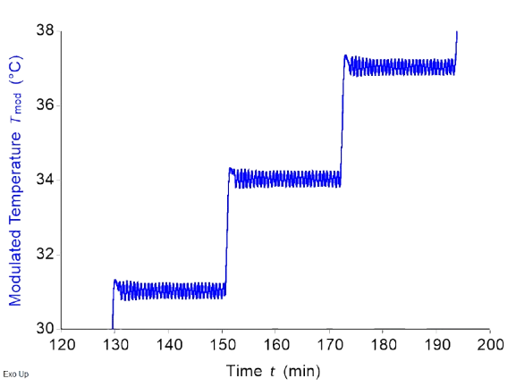
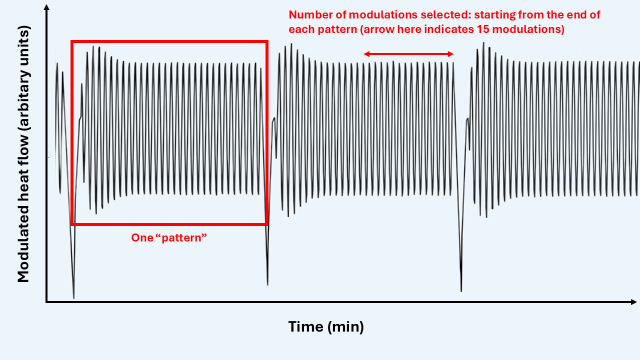

# Quasi-isothermal modulated DSC deconvolution
## Function 
Quasi-isothermal mDSC can be performed to ensure that a sample is always in equilibrium. During an mDSC run with an underlying linear temperature ramp, the constant temperature changes and thermal events cause the sample to never be in full equilibrium. Quasi-isothermal mDSC ensures equilibrium by allowing the sample to equilibrate at a certain average temperature while only a temperature modulation is applied, not a temperature ramp. Thus, there are only small temperature variations compared to the average at that moment. 

As a result, the events seen on quasi-isothermal mDSC are not necessarily the same as on regular mDSC. For example, a melting event taking place very quickly will not be present, or much less prominently so, in quasi-isothermal mDSC since the melting was already finished once equilibrium had been reached. 

A small snippet of a typical temperature versus time graph of a quasi-isothermal mDSC run is shown in Figure 1. The output of quasi-isothermal mDSC is a modulated heat flow signal in function of time or temperature. Unfortunately, not all standard mDSC software can deconvolute this signal. This is where this software comes in.

{.center}

 <b>Figure 1. </b>Temperature - time graph of a quasi-isothermal mDSC run. 

## Input and output
The user needs to input several parameters to run a quasi-isothermal mDSC, but also to run the software:
1.	Starting temperature (°C)
2.	Step size (°C)
3.	Isotherm length (min). 
4.	Sampling rate (points/second)

The required modulation parameters are as follows: 
1.	Modulation amplitude (°C)
2.	Modulation period (minutes).

Based on the parameters mentioned above, it cleans up the data to only keep the relevant oscillatory signals. It then deconvolutes these signals into reversing and non-reversing heat flows. All the parameters mentioned above are required for the software to perform the deconvolution, but it also requires an additional one. The last modulations within a signal oscillatory pattern (Figure 2) are the ones that represent the sample at equilibrium. Thus, the user can select how many oscillations (counting from the right) should be considered for the deconvolution. 

{.center}

 <b>Figure 2. </b> Visual explanation of several of the user inputs required for the app. 

 
 

After running the analysis on an mDSC instrument, the user needs to export an Excel.  This Excel needs to be loaded into the software by clicking “Browse…” and selecting the right file. Importantly: 

1.	The Excel file must be in the .xlsx or .xls format. 
2.	The Excel must not be opened on the user’s computer when loading it. 
3.	The Excel must have the time data (in minutes), the modulated temperature data (in °C) and the normalized modulated heat flow data (in W/g). It is preferable that it does not contain other heat flow data, since it might throw an error otherwise. The order of the columns does not matter. The presence of rows containing other information does not matter. These things are all detected and filtered out appropriately, since the program looks for the words “time”, “modulated” and “temperature”, and “modulated” “heat” “flow”. Note that the terms in your titles must be separated by spaces, e.g., write “modulated temperature”, not “modulated_temperature”. 
4.	The user must select the sheet to be read in manually if the data is not in the first sheet of the Excel. 
5.	It is of the utmost importance that the data exported to the Excel contains enough significant figures; preferably 5 or above. If not, maxima and minima will not be detected accurately (due to overlapping values), and the program will fail or produce unreliable results. A warning is printed if this is the case. 

After inputting the parameters and the Excel, the analysis is carried out by pressing the “calculate” button. Resulting reversing and non-reversing heat flow thermograms are then available in the “graphs” tab. Moreover, several of the thermograms obtained in the intermediary cleaning steps can also be viewed. These can be used as verification.

The output Excel and some plots can be downloaded automatically by checking the right checkboxes on the input tab. The Excel resulting from the analysis can be downloaded via the “Downloads” tab. Different figures of the resulting thermograms can also be downloaded via the same tab. Not all thermograms are available there, but the user can also download a thermogram directly via the graph itself. To do this, click the small camera on the top right of any graph.  If you recalculate for a different number of modulations, the Excel download resets, and either a new one is saved immediately (if you checked the respective checkbox on the input tab), or you can download the new one manually via the Downloads tab. 

## Mathematical and theoretical background
Only the mDSC deconvolution-specific details are mentioned here. Details on how the software comes to a series of modulations to analyze is specified below. 

### Total heat flow calculation
For normal mDSC,
THF= 〈dQ/dt〉.
However, in the case of quasi-isothermal mDSC, this operation results in the NRHF, not in the THF (but the calculation is identical). 
In terms of Fourier transformations, the zero frequency component after performing a fast Fourier transform is sometimes called the “DC” component. This is simply the average value of an oscillating signal, and it considered to be the THF in this case. 

### Reversing heat flow calculation
It was shown in the background theory that: 
$$
Rev_{Cp}=  \frac{A_{MHF}}{\frac{2π A_{temp}}{T}}.
$$

Thus, it is necessary to extract A_MHF from the modulated heat flow signal. This can be done by analyzing the raw modulated heat flow (MHF) signal, or through a fast Fourier transform. The fast Fourier transform (FFT) is discussed first. 

Performing a Fourier transform on the MHF returns a list of frequencies on the x-axis with corresponding amplitudes on the y-axis. The frequency of interest in this case is known, since it is part of the user input. It is called the first harmonic moving forward. 

For an ideal signal, it would be possible to simply extract the amplitude at the first harmonic frequency after performing the FFT and multiplying by two to correct for symmetric negative frequencies. However, the signal is not necessarily periodic, can contain only few time points in certain cases, and the frequency bins generated by the Fourier transform might not include the target frequency. These issues are solved by multiplying the Fourier-transformed data by a Hanning window, by zero-padding, and by quadratic interpolation respectively. Moreover, all signals are detrended by subtracting their mean value before applying any of the other functions mentioned below. 

A Fourier transform requires periodicity, since it is a function that goes to infinity. This means that the start of a signal should be the same as its end, in such a way that appending a signal to itself does not introduce discontinuities. This is only the case for ideal signals, but not for real-life ones. To reduce non-periodicity in signals, a Hanning window can be used. This is a function that can be used to induce periodicity in a signal by forcing the edges of the signal to go to zero. To do this, the signal is multiplied by the Hanning window $w(n)$, which is defined as such: 

$$
w(n)=0.5*(1-cos⁡(\frac{2πn}{N})),
$$

which consists of a series of points $n$, with a total length of $N$ ($N$ is the number of time points in the original signal). Since applying a Hanning window leads to a reduction in magnitude, a correction factor of $\frac{1}{0.5}$ (called coherent gain) is applied to the final magnitudes. Not performing the Hanning transformation leads to spectral leakage and results in a significant reduction in the quality of the output data. 

After the Hanning window transform, the signal is zero-padded. A Fourier transform generates a series of frequency bins on the x-axis. Having more time points in the original signal results in more frequency bins, and thus better frequency resolution. This is necessary, since only the first harmonic frequency (which is user input) is of interest in this case. A way to add more time points to a dataset is to zero-pad, i.e., to add zeros to a signal. This does not influence the Fourier transform much and only results in better frequency resolution. 

Finally, even with the improved frequency resolution, the exact target frequency might still not be a part of the generated frequency bins – although the neighboring bins should be close. This is why quadratic interpolation is also performed. A parabola can be represented by the following formula: 

$$
y(x)=a(x-p)^2+b.
$$

Three points are defined, namely $y(-1)$, $y(0)$, and $y(1)$.  Here, $y(0)$ is the point closest to the target value, whereas the other two points are the points adjacent to $y(0)$. Additionally, the maximum of the parabola is assumed to be the target frequency. The respective parameters can be derived to be:

$$
p=\frac{y(-1)-y(1)}{4a}, \quad \quad \text{and} \quad \quad a= \frac{1}{2}(y(-1)-2y(0)+y(1)).
$$

From these, it can be derived that: 

$$
y(target)=y(0)- \frac{1}{4}(y(-1)-y(1))p.
$$

Finally, y(target) is normalized by dividing by the number of points in the Fourier transform, is multiplied by two for symmetrical negative frequencies, and is divided by the coherent gain from the Hanning window as was mentioned previously. This is $A_{MHF}$. RHF is then found using the equation stated at the start of this section. 
Another, much simpler, way of computing $A_{MHF}$ is to analyze the raw modulated heat flow signal without computing any Fourier transform. To do this, for one series of modulations at a certain temperature, the mean maximum and mean minimum value is computed. Then, the following formula is applied: 

$$
A_{MHF}=\frac{mean_{maxima}-mean_{minima}}{2}.
$$

The $RevCp$ is then calculated from $A_{MHF}$ as stated above. There is no point in calculating RHF since there is no underlying linear heating rate. 
It must be stated here that currently, the software does not allow for calibration corrections. Normally, in an mDSC deconvolution process, RHF is obtained by also multiplying by a certain correction factor obtained through calibration. This is not possible in the current software version. 

### Reference temperature calculation
The user input consists of the modulated heat flow, the modulated temperature and the time. None of these are useful x-axis labels. Instead, it is much more useful to plot heat flow data against some reference temperature (TRef) that is determined based on the starting temperature (user input) and the step size in °C (user input). Moreover, the software automatically identifies the different patterns, or groups of modulations (see below). The following formula is then used to compute the x-axis:

## Details on how the software works
1. The Excel sheet is loaded and column names are assigned based on titles present in the Excel. 
2. There are only a few temperature ranges that are possible, if the starting temperature, the step size, and the amplitude are known. First, a vector of integers is generated:
    $$
    ranges(n)= \mathrm{c \left [0: \left (\frac{round(d$modTemp[length(d$modTemp)])}{stepSize}+10 \right ) \right ]}
    $$

    then,

    $$
    rangesmax=startingTemp+rangesn*stepSize+setAmplitude+0.25
    $$

    $$
    rangesmin=startingTemp+rangesn*stepSize-setAmplitude-0.25.
    $$
    
    All points not contained between $rangesmax[i]$ and $rangesmin[i]$ are deleted. These correspond to the points in between the oscillatory patterns and are not of interest. 

3. The resulting data frame is filtered for duplicate time points, which would prevent proper maxima and minima detection. 
4. Detect the “patterns” (see Figure 2). This is done using: 

$$
pattern = \mathrm{floor} \left( \frac{ \text{modTemp} - \text{startingTemp} + \text{setAmplitude} + 0.25 }{ \text{stepSize} } \right)
$$

5. Neighbouring duplicate temperatures are deleted. 
6. A function called "locate_extrema_manual" is called: within a window of fifty points, it uses which.max to locate maxima. Minima are detected in a similar way using which.min
7. The number of minima and maxima are counted. 
8. The index of the last maximum and minimum of each pattern is determined. A series of if/else statements determine what to keep:
  - If for a particular pattern the minimum temperature is above the reference temperature for that pattern, all data after the last maximum is deleted. If not, all data is kept. 
  - If for a particular pattern the distance (index) between the last minimum and the last detected maximum is less than: 

    $$
    \mathrm {1.1* \left( \frac{sampling rate*period}{2} \right)},
    $$

    all data after the second-to-last maximum is deleted. 

9. One of the user inputs is the number of modulations that need to be taken into account for the calculation ($modulationsBack$, also see Figure 2). Maxima and minima are detected through locate_extrema_manual once more, and only the data between $[“last maximum-modulationsBack”: “last maximum”]$ is kept for analysis. 
10. Mathematical operations are carried out for each pattern as described in the section above. The data generated by this operation is plotted using plotly.
11. ggsave and writexl are used to generate an output for the user in their respective tab.  
