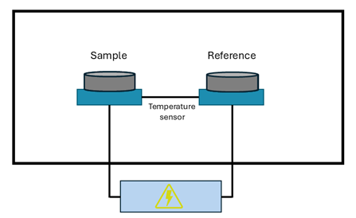
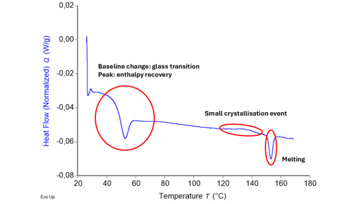
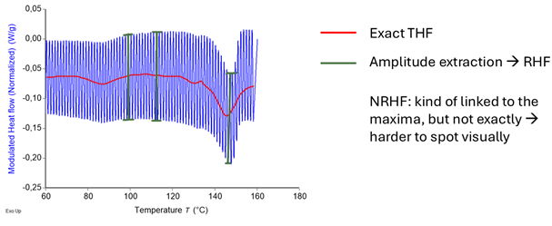
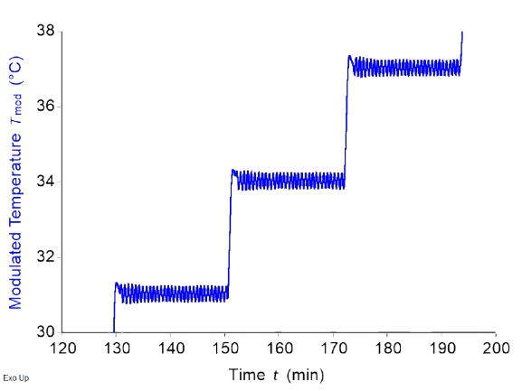
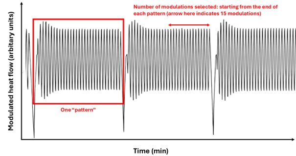

# General information
Please note that general information regarding installation, testing, and collaboration is available in the README file. This document only dives into the more technical aspects of DSC, the app in general, and the different sub apps. Also note that the information presented in the overview is available inside the software package as well. 

# Tutorial for the overarching app

Welcome to the mDSC analysis software package, a software package intended for people that want to dive much deeper into their mDSC data. If you are not familiar with mDSC, 
we recommend you go to the section about theoretical background first, since the 
following will be technical. This package is intended to help you with:

1. **DSC descriptive statistics**: Quickly calculating averages, standard deviations, 
and relative standard deviations based on mDSC analyses performed in TRIOS®. Thus,
for using this app, your data must already be in specifically formatted Word tables 
and documents.  

2. **Quasi-Isothermal modulated DSC deconvolution**: this type of analysis is not 
always present in all DSC software packages (such as TRIOS®), hence the need for 
a user-friendly app to do this. The input required here is an Excel with your
raw modulated heat flow, modulated temperature, and time. 

3. **Regular modulated DSC deconvolution**: in software packages, this is done by 
using a rolling Fourier transform to extract the amplitude and average of the 
signal. However, in certain cases, this type of deconvolution can lead to artifacts.
This is why it is useful to also calculate the amplitude and average of the signal
based on the maxima and minima in the raw data, without using a Fourier transform.
Moreover, it might be useful to compare this data to unmodulated DSC data, as well
as modulated DSC data that was deconvoluted with a Fourier transform. This package
combines all these features. It package requires an Excel file containing 
temperature, time, and modulated heat flow. 

4. **Modulated DSC deconvolution simulation**: it might be interesting, based on 
events that are already known, to mathematically simulate deconvolution of 
modulated DSC thermograms. This app requires you to already have performed 
modulated DSC on a sample, since inputs such as onset temperatures, midpoint
temperatures, heat capacities, and enthalpies are required. The app uses this
data to construct a modulated heat flow signal, which is subsequently deconvoluted 
into the reversing, total and non-reversing heat flows.

## Theoretical background of DSC and mDSC

Since many parts of the different apps use the same theoretical foundations, a 
theoretical background is given here. It will be referred to as required in the 
different sub-apps.

### Differential scanning calorimetry (DSC)

Differential scanning calorimetry (DSC) is one of the most common methods to 
study the thermal properties of materials. It is of crucial importance in polymer
chemistry and physics, material science, pharmaceutical science, and so forth. 
It allows the user to characterize material properties such as glass transitions,
crystallization and melting events, solvent evaporation, degradation, or any other
detectable event that involves a change in enthalpy or heat capacity. 

A DSC experiment consists of heating two small pans (a pan weight of around 
20-30 mg is most common) from a given temperature to a given temperature at a 
certain heating rate. One of the pans is empty and is called the reference pan.
The other pan contains several milligrams of sample and is referred to as the 
sample pan. As both pans are heated by the furnace (blue blocks in *Figure 1*). 
transitions occur in the sample. This results in a temperature difference,
$\Delta T$ between the sample and reference pans. The total heat flow 
$\frac{dQ}{dt}$, which is the energy flowing to the sample per unit of time, can 
then be derived to be the following:\

$$
\frac{dQ}{dt} = -\frac{\Delta T}{R_r} \quad \quad \quad \quad \text{(Equation 1)}
$$

Where R_r is a resistance term. This simple equation does not consider differences 
in heat capacity between the two furnaces, differences in heat capacity between 
the sample and reference pans, and other instrumental effects. Hence, equations 
that are used to calculate heat flow in DSC are generally more complex. Moreover, 
calibration is always necessary for all DSC instruments to correct for 
instrumental error. Nonetheless, the sample contribution is still fully contained 
in *Equation 1*.

  

<strong>Figure 1.</strong> Basic representation of a differential scanning calorimeter.

The result of a DSC run is a thermogram where heat flow, often normalized for 
sample mass, is generally plotted against temperature. From a thermogram, the
onset, peak (or midpoint in the case of glass transitions), and endset temperatures
of thermal events can be obtained. Moreover, integrating the area under the 
curve of a heat flow versus time (in seconds) thermogram results in the change 
in enthalpy associated with a certain event. An example of a thermogram 
containing a glass transition, an enthalpy recovery, a crystallization event,
and a melting event is shown in *Figure 2*. Further instructions on how to analyze 
and interpret thermograms are not included in this text.

  

<strong>Figure 2.</strong> Typical thermogram resulting from a differential scanning 
calorimetry experiment. Different thermal events are present and highlighted in 
the figure.

The value of the heat flow signal depends on the heating rate. Hence, sometimes, 
the heat capacity is plotted, since it is normalized for heating rate. The 
relationship between heat capacity ($C_p$) and heating rate ($\beta$) is as 
follows when exothermic events are plotted up:

$$
C_p (\frac{J}{°Cg}) = -\frac{\frac{dQ}{dt}(\frac{J}{g s})}{\beta (\frac{°C}{s})} \quad \quad \quad \quad \text{(Equation 2)}
$$

The minus sign here is crucial and must be explained further. If a sample is 
giving off heat (for instance when it is crystallizing), the furnace supplies 
“negative power” and it would make sense for the heat flow to be negative. This
becomes all the more obvious when discussing this in terms of $C_p$. It is 
defined formally, meaning that there is no option for “peak up” or “peak down”. 
For example, there would be a downward $C_p$ peak during crystallization since 
the sample is giving off heat, and so it’s apparent $C_p$ is much lower. There 
is no real choice here when it comes to plotting peaks up or down. Since the 
definition of $C_p$ is clearly defined but $\frac{dQ}{dt}$ can be plotted with 
exotherms either up or down, a minus sign needs to be inserted as a bookkeeping 
quantity when exotherms are plotted up (or in other words, when endotherms are 
plotted down). This is why all thermograms normally mention whether exo is up or
exo is down. For this software package, “exo up” is used for everything going 
forward.

Now that the basics of DSC are clear, it is time to discuss the simple 
temperature program used in unmodulated DSC, since this will paint the picture
for the main differences between modulated (mDSC) and unmodulated DSC (still DSC).
For a DSC analysis, temperature ($T$) can be expressed as follows:
$$
T = T_0 + \beta t \quad \quad \quad \quad \text{(Equation 3)}
$$

where *t* is the time, and *β* is the heating rate. Taking the derivative simply gives:

$$
\frac{dT}{dt} =β \quad \quad \quad \quad \text{(Equation 4)}               
$$

This is a very important difference when comparing to DSC and mDSC, where the temperature program is more complex. 

### Modulated differential scanning calorimetry (mDSC)

First and foremost, all the basics lined out in the previous section about DSC are still valid for mDSC. The only element that varies substantially is the temperature program, which in turn results in an oscillating heat flow signal, called the modulated heat flow (MHF), rather than the simple heat flow that we got for DSC. Interpreting the raw MHF is not very practical, hence why it needs to be deconvoluted. The derivations and steps required for this are discussed in this section. 

The main difference between unmodulated and modulated DSC is that the heating rate is not a constant value. There are different possible heating programs, such as sawtooth modulations, sine wave modulations, and so forth. In the context of this software package, only sine wave modulations are taken into consideration. This means that the temperature can now be written as such: 

$$
 T=T_0+ βt + A_{temp} sin(ωt) 
$$

where A_temp is the temperature modulation amplitude and ω is the frequency. Hence, the derivative of the temperature, namely heating rate, is now:

$$
\frac{dT}{dt} = β+A_{temp} ωcos(ωt)  \quad \quad \quad \quad \text{(Equation 5)}
$$

The cosine wave presented in equation 5 results in a similar oscillation in the heat flow. That is why it is now called the modulated heat flow (MHF) to distinguish it from the other heat flows.

The MHF has two important components, namely its average value (kinetic component) and its amplitude (reversing component). Notice how they are independent: the amplitude of a cosine oscillation says nothing about its average value. For instance, for:

$$
y=Acos(x)+k,
$$

the average value is k while the amplitude is A. In mDSC terms, this is represented as follows: 

$$
\frac{dQ}{dt} =MHF=C_p\frac{dT}{dt} +f(t,T) = C_p A_{temp} ωcos(ωt)  + C_p β + f(t,T)    \quad \quad \quad \quad \text{(Equation 6)}
$$

where the first term is the reversing component, the second term is essentially the baseline, and the third term is the kinetic component. The reversing component is represented by thermal events that happen fast enough to react to the quickly changing modulated temperature. Moreover, these events must be reversible to an extent. Examples are glass transitions and certain types of reversible melting. Reversibility in the context of mDSC is strictly equivalent with thermodynamic reversibility, but they do share similarities. Indeed,  thermodynamically reversible events will show up on the reversing heat flow, but not all events present on the reversing heat flow are strictly thermodynamically reversible. 

In contrast, kinetic phenomena happen too slowly to be seen in the reversing heat flow, which is generated through the quickly changing temperature. In other words, they are time dependent. Moreover, they are temperature dependent as well because they might need a certain activation temperature to occur. Hence, these events are represented by the f(t,T) term in equation 6. Examples are solvent evaporation, enthalpy recovery, melting, and crystallization. 

As was mentioned before, it is desirable to deconvolute the MHF into signals that are easier to interpret. First, the kinetic and baseline components, or the total heat flow (THF), is extracted from the MHF. In other words based on what is stated above, 

$$
THF= 〈\frac{dQ}{dt}〉= C_p β + f(t,T)    \quad \quad \quad \quad \text{(Equation 7)}.
$$

Next, the reversing component, called the reversing heat flow (RHF) , is extracted as such. We equate the two oscillating components from equation 6, namely the (implicit) oscillating component of the MHF and the oscillating component on the right side of equation 6:  

$$
A_{MHF} cos(ωt)= C_p A_{temp} ωcos(ωt).
$$

Isolating $C_p$, we get: 

$$
C_p=\frac{A_{MHF} cos(ωt)}{A_{temp} ωcos(ωt)}. 
$$

Introducing the concepts from equation 2 and using the period $T$ in seconds instead of $ω$ in rad per second: 

$$
RHF= -β \frac{A_{MHF}}{\frac{2π A_{temp}}{T}}  \quad \quad \quad \quad \text{(Equation 8)}
$$

Equation 8 is the general equation to calculate the RHF that is used throughout the software. A_THF is the only parameter to be calculated in this equation, since the rest is all user input. 

It has been stated so far that we must find $〈\frac{dQ}{dt}〉$ and $A_{MHF}$, but not how to do this. An excellent tool for this is the Fourier transform. A complete discussion of the mathematics behind this is outside of the scope of this text. However, it is useful to discuss what it does. Essentially, it generates an amplitude versus frequency graph based on the MHF signal. The amplitude at zero frequency is often called the DC component and is essentially  $〈\frac{dQ}{dt}〉$. The amplitude at the frequency of the modulated temperature signal, related to the value ω that was chosen by the operator, is $A_{MHF}$. Not just one Fourier transform it performed, but multiple, in a rolling fashion. What is meant by this is that a window (generally one period in width) moves along the MHF thermogram. For every step of the window, the Fourier transform is computed and THF and RHF are extracted. In the case of the THF, this is equivalent of taking a rolling average, since a rolling average also cancels out any contributions from the sine wave is the width of the window is exactly one period (which it is). 

In practice, it is sometimes not this simple. Real mDSC data can be messy and noisy, resulting in a very poor Fourier transform. This is why this data  is often transformed and manipulated first. Moreover, taking the Fourier transform can introduce artifacts, so one can use other tricks to avoid having to perform one. These are detailed in the different subapps when necessary. 
Finally, the non-reversing heat flow (NRHF) is simply calculated by subtracting the RHF from the THF: 

$$
NRHF=THF-RHF    \quad \quad \quad \quad \text{(Equation 9).}
$$

A summary of this discussion is presented in Figure 3. The different methods are explained in further detail in the documentation of the respective sub apps. 

  

<strong>Figure 3.</strong> Visual summary of how modulated heat flow is deconvoluted into the total, reversing, and non-reversing heat flows.

### A note on more fundamental derivations
The way the equations for THF, RHF, and NRHF were derived here was not strictly based on first principles, namely the laws of heat transfer. Even though everything is mathematically consistent without referring to these laws, it might be interesting to consult the book by B. Wunderlich mentioned below for those wanting to delve deeper into this material. 

## Additional mDSC resources
1. Wunderlich, B. *Thermal Analysis of Polymeric Materials*. Springer eBooks (2005). [https://doi.org/10.1007/b137476](https://doi.org/10.1007/b137476)

2. Reading, M., Elliott, D., & Hill, V.L. A new approach to the calorimetric investigation of physical and chemical transitions. *Journal of Thermal Analysis*, **40**, 949–955 (1993). [https://doi.org/10.1007/BF02546854](https://doi.org/10.1007/BF02546854)

3. Rabel, S.R., Jona, J.A., & Maurin, M.B. Applications of modulated differential scanning calorimetry in preformulation studies. *Journal of Pharmaceutical and Biomedical Analysis*, **21**(2), 339–345 (1999). [https://doi.org/10.1016/s0731-7085(99)00142-9](https://doi.org/10.1016/s0731-7085(99)00142-9) — PMID: 10703989

4. Craig, D.Q.M., & Royall, P.G. The use of modulated temperature DSC for the study of pharmaceutical systems: potential uses and limitations. *Pharmaceutical Research*, **15**, 1152–1153 (1998). [https://doi.org/10.1023/A:1011967202972](https://doi.org/10.1023/A:1011967202972)

5. Royall, P.G., Craig, D.Q.M., & Doherty, C. Characterisation of the glass transition of an amorphous drug using modulated DSC. *Pharmaceutical Research*, **15**, 1117–1121 (1998). [https://doi.org/10.1023/A:1011902816175](https://doi.org/10.1023/A:1011902816175)

6. Thomas, L. *Modulated DSC® Paper #2: Modulated DSC® Basics; Calculation and Calibration of MDSC®*. TA Instruments, 2005.

7. *MODULATED DSC® (MDSC®): HOW DOES IT WORK?* TA Instruments.

# Tutorial for DSC descriptive statistics

## Function
The main goal of this application is to speed up DSC data analysis. Since it is compatible with TRIOS, this software can also be used to analyze data from other applications, such as thermogravimetric analysis or viscosity measurements - as long as the data is generated as specified in the input section. The program simply groups the input into several categories and calculates means, standard deviations (or spreads in the case of only 2 data points), and relative standard deviations (or relative spreads).

## Input and output
The app takes word documents as input and outputs formatted Excel tables. These Word files are generated using a semi-automised process in TRIOS, software by TA instruments (another section of the tutorial instructs you on how to do this). Word files are used because they are the most customizable and straightforward to generate in TRIOS. The input required in the various menus helps the program to separate your heating cycles. They are basically landmarks for the program. The main purpose of the program is to generate descriptive statistics for your data, but you can also export raw data.

### Steps in TRIOS
The first thing you’ll need to do is generate the word documents you’ll feed into the app in TRIOS. Here is how you do it. This part assumes you know the TRIOS software well already, and is not a full tutorial for the software.

1. Open the files you want to analyze.
2. Don't split the files into the different cycles, but simply send each cycle to a new graph. Do so by right clicking on a step in the file manager on the left and selecting "send to new graph".
3. Perform the analysis manually like you normally would for each heating or cooling cycle. When you save your analysis (see next point), TRIOS can distinguish the different cycles and knows what analysis was performed for which cycle.
4. Go to format > save analysis. This will save a file.
5. Now, go to format > generate report. A new screen pops up. You will see many options on the right side of the screen. In these options, you will find the analyses you did, grouped per heating cycle. Dragging one of the options (for example the onset of a certain integration you did) to the screen on the left displays the value. However, in order for the app to work, you’ll need to follow these very specific instructions.
6. Every event you want to analyze is one single table. For example, if you have a glass transition and a melting point of interest in heating cycle 1, you’ll have two tables for that heating cycle.
7. Implement tables in the TRIOS report file by clicking the “table” option in the top area.
8. Every table has one “title column”: the first (most left) column is always considered to contain some kind of title, so do not put any values there. Besides this limitation, you may have as many columns as you wish in your tables, and different tables can have different numbers of columns.
9. Every table has two rows. One is the “title row” containing more detailed information on the values in the row below. For example, you might want to put something like "Tg onset (°C)", "Tg midpoint (°C)", and "Tg end (°C)". The second row contains the values matching each title. Making your titles nicely from the start is helpful because the program can read those and use them for the output Excel.
10. The final result should look something like this, for every table:

    <table>
    <thead>
        <tr>
        <th> -general title- </th>
        <th> -title- </th>
        <th> -title- </th>
        <th> -title- </th>
        <th> -title- </th>
        </tr>
    </thead>
    <tbody>
        <tr>
        <td> -nothing- </td>
        <td> -value- </td>
        <td> -value- </td>
        <td> -value- </td>
        <td> -value- </td>
        </tr>
    </tbody>
    </table>

- Important note: when making your tables in TRIOS, you’ll see an option regarding table headers. DO NOT select this option, as otherwise the code will read your table as having just one row, violating the rule above stating that every table needs two rows. Also note that when you open the documents in word afterwards and change something in the tables, word might chagne the layout for some reason and still add a header row. The program will spot this and give an error, but be aware that this can cause this particular error. As long as you follow the rules above, you may have as many tables as you wish and as many tables per heating cycle as you wish. There’s no further need for consistency.
11. Next, you will want to save your report as a template. Do this by clicking  “save template” in the options at the top.
12. So far, everything was manual, but here is where the automation comes in. You can apply the saved analysis and the saved report template to a new file, and the analysis will be carried out automatically, including the generation of a report. As a matter of fact, you can also only save the report as a template and apply that directly. This is a bit quicker, but the downside is that you won't be able to drag new analysis elements to add new values in the report. If one sample requires slightly different integration limits, you can simply modify the values in the report by editing the analysis in the the tab that was generated when you applied the report template (see tab list on the bottom of the screen, -your sample title- (Report 1). The Word documents you just made semi-automatically serve as the app's input."),
13. Export the reports you made as word documents by clicking the TRIOS logo on the top left, and you’re all set!

## Mathematical and theoretical background
There is not much to be said about the mathematical and theoretical background here. The arithmetic mean, sample standard deviation, relative sample standard deviation, spread and relative spread are all calculated based on standard formulae. 

## 	Details on how the software works
#### Generating the interactive UI 
This piece of code changes the menus the user sees based on the values of other menus. For example, if you indicate having 3 heating cycles, you will be asked thrice about how many tables you have in each heating cycle. This is also for a large part where user input variables are defined.

#### Extracting tables
This is the first actual analysis part of the code. Tables in word documents have assigned numbers in the xml file. You don’t see this, but the code can read this. This is the whole principle behind extracting the data.
From every “table 1” of every file, the second row of values is extracted. The rows thus extracted are grouped in one long vector called tempDf. tempDf is then cleaned and rendered numeric.
You’ll notice that everything works based on for-loops in the code. Important user inputs are the number of pans, the number of heating cycles, and the number of tables per heating cycles. The former two are values, while the latter is a vector. "

#### Grouping tables into df
The different tempDf vectors are then grouped into a table called df. This works smoothly when df and tempDf are of the same length, but this is often not the case. Hence, when needed, NAs are inserted at the right locations so as not to influence the descriptive statistics.

#### Grouping dfs into allCycles
All the dfs are then grouped into another data frame called allCycles, again taking into account different lengths. allCycles is printed in case the user wants to export their raw data as well. 

#### Generating dataFrameCycle from df
DataFrameCycles is composed of different rows which are in turn composed of the different statistics. This is very easy to edit, and if reader wishes to have additional statistics (more than just means, SDs and relative SDs), they can edit this part relatively quickly.

#### Binding the dataFrameCycles to combinedStats
The different dataFrameCycles, which regroup the data per heating cycle, are combined into combinedStats.

#### Generating the vectors containing the titles
The next block of code makes a list containing all the column titles, but only if the user indicates that they want to keep the titles of their original tables.

#### Picking appropriate entries from combinedStats and grouping them per heating cycle, adding titles, writing to an excel
Finally, data is extract back to several different data frames from combined stats using some arithmetic, is bound with the appropriate title vectors, and is written to an excel. 

#### What’s left 
Other code snippets are mainly error- and exception handling. Error handling gives a clear output to the user in case they did something wrong, while exception handling ensures that the code can work no matter the data structure. For example, the rest of the code would sometimes cause issues when all the tables only have two columns.

# Quasi-isothermal modulated DSC deconvolution
## Function 
Quasi-isothermal mDSC can be performed to ensure that a sample is always in equilibrium. During an mDSC run with an underlying linear temperature ramp, the constant temperature changes and thermal events cause the sample to never be in full equilibrium. Quasi-isothermal mDSC ensures equilibrium by allowing the sample to equilibrate at a certain average temperature while only a temperature modulation is applied, not a temperature ramp. Thus, there are only small temperature variations compared to the average at that moment. 

As a result, the events seen on quasi-isothermal mDSC are not necessarily the same as on regular mDSC. For example, a melting event taking place very quickly will not be present, or much less prominently so, in quasi-isothermal mDSC since the melting was already finished once equilibrium had been reached. 

A small snippet of a typical temperature versus time graph of a quasi-isothermal mDSC run is shown in Figure 4. The output of quasi-isothermal mDSC is a modulated heat flow signal in function of time or temperature. Unfortunately, not all standard mDSC software can deconvolute this signal. This is where this software comes in.

  

<strong>Figure 4.</strong> Temperature - time graph of a quasi-isothermal mDSC run. 

## Input and output
The user needs to input several parameters to run a quasi-isothermal mDSC, but also to run the software:
1.	Starting temperature (°C)
2.	Step size (°C)
3.	Isotherm length (min). 
4.	Sampling rate (points/second)

The required modulation parameters are as follows: 
1.	Modulation amplitude (°C)
2.	Modulation period (minutes).

Based on the parameters mentioned above, it cleans up the data to only keep the relevant oscillatory signals. It then deconvolutes these signals into reversing and non-reversing heat flows. All the parameters mentioned above are required for the software to perform the deconvolution, but it also requires an additional one. The last modulations within a signal oscillatory pattern (Figure 5) are the ones that represent the sample at equilibrium. Thus, the user can select how many oscillations (counting from the right) should be considered for the deconvolution. 

  

<strong>Figure 5.</strong> Visual explanation of several of the user inputs required for the app.

 
 

After running the analysis on an mDSC instrument, the user needs to export an Excel.  This Excel needs to be loaded into the software by clicking “Browse…” and selecting the right file. Importantly: 

1.	The Excel file must be in the .xlsx or .xls format. 
2.	The Excel must not be opened on the user’s computer when loading it. 
3.	The Excel must have the time data (in minutes), the modulated temperature data (in °C) and the normalized modulated heat flow data (in W/g). It is preferable that it does not contain other heat flow data, since it might throw an error otherwise. The order of the columns does not matter. The presence of rows containing other information does not matter. These things are all detected and filtered out appropriately, since the program looks for the words “time”, “modulated” and “temperature”, and “modulated” “heat” “flow”. Note that the terms in your titles must be separated by spaces, e.g., write “modulated temperature”, not “modulated_temperature”. 
4.	The user must select the sheet to be read in manually if the data is not in the first sheet of the Excel. 
5.	It is of the utmost importance that the data exported to the Excel contains enough significant figures; preferably 5 or above. If not, maxima and minima will not be detected accurately (due to overlapping values), and the program will fail or produce unreliable results. A warning is printed if this is the case. 

After inputting the parameters and the Excel, the analysis is carried out by pressing the “calculate” button. Resulting reversing and non-reversing heat flow thermograms are then available in the “graphs” tab. Moreover, several of the thermograms obtained in the intermediary cleaning steps can also be viewed. These can be used as verification.

The output Excel and some plots can be downloaded automatically by checking the right checkboxes on the input tab. The Excel resulting from the analysis can be downloaded via the “Downloads” tab. Different figures of the resulting thermograms can also be downloaded via the same tab. Not all thermograms are available there, but the user can also download a thermogram directly via the graph itself. To do this, click the small camera on the top right of any graph.  If you recalculate for a different number of modulations, the Excel download resets, and either a new one is saved immediately (if you checked the respective checkbox on the input tab), or you can download the new one manually via the Downloads tab. 

## Mathematical and theoretical background
Only the mDSC deconvolution-specific details are mentioned here. Details on how the software comes to a series of modulations to analyze is specified below. 

### Total heat flow calculation
For normal mDSC,
THF= 〈dQ/dt〉.
However, in the case of quasi-isothermal mDSC, this operation results in the NRHF, not in the THF (but the calculation is identical). 
In terms of Fourier transformations, the zero frequency component after performing a fast Fourier transform is sometimes called the “DC” component. This is simply the average value of an oscillating signal, and it considered to be the THF in this case. 

### Reversing heat flow calculation
It was shown in the background theory that: 
$$
Rev_{Cp}=  \frac{A_{MHF}}{\frac{2π A_{temp}}{T}}.
$$

Thus, it is necessary to extract A_MHF from the modulated heat flow signal. This can be done by analyzing the raw modulated heat flow (MHF) signal, or through a fast Fourier transform. The fast Fourier transform (FFT) is discussed first. 

Performing a Fourier transform on the MHF returns a list of frequencies on the x-axis with corresponding amplitudes on the y-axis. The frequency of interest in this case is known, since it is part of the user input. It is called the first harmonic moving forward. 

For an ideal signal, it would be possible to simply extract the amplitude at the first harmonic frequency after performing the FFT and multiplying by two to correct for symmetric negative frequencies. However, the signal is not necessarily periodic, can contain only few time points in certain cases, and the frequency bins generated by the Fourier transform might not include the target frequency. These issues are solved by multiplying the Fourier-transformed data by a Hanning window, by zero-padding, and by quadratic interpolation respectively. Moreover, all signals are detrended by subtracting their mean value before applying any of the other functions mentioned below. 

A Fourier transform requires periodicity, since it is a function that goes to infinity. This means that the start of a signal should be the same as its end, in such a way that appending a signal to itself does not introduce discontinuities. This is only the case for ideal signals, but not for real-life ones. To reduce non-periodicity in signals, a Hanning window can be used. This is a function that can be used to induce periodicity in a signal by forcing the edges of the signal to go to zero. To do this, the signal is multiplied by the Hanning window $w(n)$, which is defined as such: 

$$
w(n)=0.5*(1-cos⁡(\frac{2πn}{N})),
$$

which consists of a series of points $n$, with a total length of $N$ ($N$ is the number of time points in the original signal). Since applying a Hanning window leads to a reduction in magnitude, a correction factor of $\frac{1}{0.5}$ (called coherent gain) is applied to the final magnitudes. Not performing the Hanning transformation leads to spectral leakage and results in a significant reduction in the quality of the output data. 

After the Hanning window transform, the signal is zero-padded. A Fourier transform generates a series of frequency bins on the x-axis. Having more time points in the original signal results in more frequency bins, and thus better frequency resolution. This is necessary, since only the first harmonic frequency (which is user input) is of interest in this case. A way to add more time points to a dataset is to zero-pad, i.e., to add zeros to a signal. This does not influence the Fourier transform much and only results in better frequency resolution. 

Finally, even with the improved frequency resolution, the exact target frequency might still not be a part of the generated frequency bins – although the neighboring bins should be close. This is why quadratic interpolation is also performed. A parabola can be represented by the following formula: 

$$
y(x)=a(x-p)^2+b.
$$

Three points are defined, namely $y(-1)$, $y(0)$, and $y(1)$.  Here, $y(0)$ is the point closest to the target value, whereas the other two points are the points adjacent to $y(0)$. Additionally, the maximum of the parabola is assumed to be the target frequency. The respective parameters can be derived to be:

$$
p=\frac{y(-1)-y(1)}{4a}, \quad \quad \text{and} \quad \quad a= \frac{1}{2}(y(-1)-2y(0)+y(1)).
$$

From these, it can be derived that: 

$$
y(target)=y(0)- \frac{1}{4}(y(-1)-y(1))p.
$$

Finally, y(target) is normalized by dividing by the number of points in the Fourier transform, is multiplied by two for symmetrical negative frequencies, and is divided by the coherent gain from the Hanning window as was mentioned previously. This is $A_{MHF}$. RHF is then found using the equation stated at the start of this section. 
Another, much simpler, way of computing $A_{MHF}$ is to analyze the raw modulated heat flow signal without computing any Fourier transform. To do this, for one series of modulations at a certain temperature, the mean maximum and mean minimum value is computed. Then, the following formula is applied: 

$$
A_{MHF}=\frac{mean_{maxima}-mean_{minima}}{2}.
$$

The $RevCp$ is then calculated from $A_{MHF}$ as stated above. There is no point in calculating RHF since there is no underlying linear heating rate. 
It must be stated here that currently, the software does not allow for calibration corrections. Normally, in an mDSC deconvolution process, RHF is obtained by also multiplying by a certain correction factor obtained through calibration. This is not possible in the current software version. 

### Reference temperature calculation
The user input consists of the modulated heat flow, the modulated temperature and the time. None of these are useful x-axis labels. Instead, it is much more useful to plot heat flow data against some reference temperature (TRef) that is determined based on the starting temperature (user input) and the step size in °C (user input). Moreover, the software automatically identifies the different patterns, or groups of modulations (see below). The following formula is then used to compute the x-axis:

## Details on how the software works
1. The Excel sheet is loaded and column names are assigned based on titles present in the Excel. 
2. There are only a few temperature ranges that are possible, if the starting temperature, the step size, and the amplitude are known. First, a vector of integers is generated:
    $$
    ranges(n)= \mathrm{c \left [0: \left (\frac{round(d$modTemp[length(d$modTemp)])}{stepSize}+10 \right ) \right ]}
    $$

    then,

    $$
    rangesmax=startingTemp+rangesn*stepSize+setAmplitude+0.25
    $$

    $$
    rangesmin=startingTemp+rangesn*stepSize-setAmplitude-0.25.
    $$
    
    All points not contained between $rangesmax[i]$ and $rangesmin[i]$ are deleted. These correspond to the points in between the oscillatory patterns and are not of interest. 

3. The resulting data frame is filtered for duplicate time points, which would prevent proper maxima and minima detection. 
4. Detect the “patterns” (see Figure 2). This is done using: 

$$
pattern = \mathrm{floor} \left( \frac{ \text{modTemp} - \text{startingTemp} + \text{setAmplitude} + 0.25 }{ \text{stepSize} } \right)
$$

5. Neighbouring duplicate temperatures are deleted. 
6. A function called "locate_extrema_manual" is called: within a window of fifty points, it uses which.max to locate maxima. Minima are detected in a similar way using which.min
7. The number of minima and maxima are counted. 
8. The index of the last maximum and minimum of each pattern is determined. A series of if/else statements determine what to keep:
  - If for a particular pattern the minimum temperature is above the reference temperature for that pattern, all data after the last maximum is deleted. If not, all data is kept. 
  - If for a particular pattern the distance (index) between the last minimum and the last detected maximum is less than: 

    $$
    \mathrm {1.1* \left( \frac{sampling rate*period}{2} \right)},
    $$

    all data after the second-to-last maximum is deleted. 

9. One of the user inputs is the number of modulations that need to be taken into account for the calculation ($modulationsBack$, also see Figure 2). Maxima and minima are detected through locate_extrema_manual once more, and only the data between $[“last maximum-modulationsBack”: “last maximum”]$ is kept for analysis. 
10. Mathematical operations are carried out for each pattern as described in the section above. The data generated by this operation is plotted using plotly.
11. ggsave and writexl are used to generate an output for the user in their respective tab.  

# Regular modulated DSC deconvolution

## Function
As is mentioned in the theoretical background of the main menu, the deconvolution procedure of the modulated heat flow is normally carried out by using a Fourier transform. However, this mathematical manipulation can sometimes introduce artifacts. Hence, it might be useful to also deconvolute the data in a different way, by looking at the raw modulated heat flow signal. Additionally, comparing the results from the Fourier transform and those obtained through the alternative method can be informative when it comes to detecting artifacts. Hence, this app also offers a Fourier-transform based method for the user to compare the two outputs easily. Moreover, it can be interesting to also compare the mDSC data with unmodulated DSC data. This app also offers an option to do this. 

## Input 
The user must perform an mDSC analysis of a sample and export an Excel containing/characterized by the following: 

1.	The Excel file must be in the .xlsx or .xls format. 
2.	The Excel must not be opened on the user’s computer when loading it. 
3.	The Excel must have the **time data (in minutes)**, **the temperature data** (in °C) and the **normalized modulated heat flow data** (in W/g). It is preferable that it does not contain other heat flow data, since it might throw an error otherwise. The order of the columns does not matter. The presence of rows containing other information does not matter. These things are all detected and filtered out appropriately, since the program looks for the words “time”, “modulated” and “temperature”, and “modulated” “heat” “flow”. Note that the terms in your titles must be separated by **spaces**, e.g., write “modulated heat flow”, not “modulated_heat_flow”. If the user wishes to compute the RHF based on the deconvolution performed by the manufacturer’s software, a total heat flow column must also be present. 
4.	The user must select the sheet to be read in manually if the data is not in the first sheet of the Excel. 
5.	It is of the utmost importance that the data exported to Excel contains enough significant figures; preferably 5 or above. If not, maxima and minima will not be detected accurately (due to overlapping values), and the program will fail or produce unreliable results. A warning is printed if this is the case. 

This input is required to perform the analysis of the mDSC data, be it using the amplitudes of the modulated heat flow signal or the Fourier transform. Moreover, the user must specify the period, the heating rate, and the temperature modulation amplitude. 

If the user wishes to make a comparison with regular DSC, they tick the corresponding checkbox in the app and upload a new Excel with the same structure as what is mentioned above, but with a total heat flow instead of a modulated heat flow (refer to point 4). 

Graphs displaying the deconvoluted thermograms can be found in the corresponding tab. An Excel with the analyzed data as well as several plots can also be downloaded via the download tab, or, in the case of the plots, via the graphs tab itself (camera in top right corner of graph when hovering over it). 

## Mathematical and theoretical background
### Deconvolution based on the modulated heat flow signal
Two equations that were derived in the overall overarching background are of importance here: 

$$
THF= 〈\frac{dQ}{dt}〉  \quad \quad \text{and} \quad \quad RHF= -β\frac{A_{MHF}}{\frac{2π  A_{temp}}{T}},
$$

The software compiles a list of all the maxima and another list of all minima. The first step in calculating the average heat flow (THF) consists of adding the maximum with index “i" to the minimum with index “i”, the maximum with index “i+1” to the minimum with index "i+1”, and so forth. The average is then calculated by dividing these points by 2. Temperatures at which these averages occur are then calculated in similar fashion. These points are then plotted against temperature in the final thermogram. The amplitude required for the RHF, $A_{MHF}$, is calculated by subtracting the minima from their respective maxima without dividing anything by two. Corresponding temperature values are then found in the same way as for the THF. $β$, $T$, and $A_{temp}$ need no further calculations since they are used inputs. The calculated RHF is plotted against temperature in the final output. 

## Details on how the software works
1.	Read in the Excel.
2.	A function called “locate_extrema_manual is called: within a window of fifty points, it uses which.max to locate maxima. Minima are detected in a similar way using which.min
3.	The number of minima and maxima are counted. 
4.	The function HFcalc splits the data frame containing both minima and maxima in two dataframes containing either type. It checks the length of these dataframes and removes a row (or multiple rows) if either one is longer. It calculates THF, RHF and NRHF as was explained in the previous section. 
The rest of the code is there to generate the user interface and execute the Shiny app. 

# Tutorial for Modulated DSC deconvolution simulation 
## Function
The mDSC simulation app is different when compared to the others in the sense that it does not require input documents. It does however require manual input of thermal events that occur in the sample. Its goal is also different. Where the other apps are meant to streamline data analysis, this software can be used to gain a better understanding of the sample and of the effect of modifying certain parameters. For example, once can input the details of where a melting peak occurs and study how using different mDSC parameters affects the shape of the melting peak by running several simulations. 

It must be said that this app is not a physical simulation. It is strictly a mathematical tool, that generated a modulated heat flow and deconvolutes it using a Fourier transform.

## Input
The exact input required depends on the events to be modeled. All the required input is stated on the respective tab and should require no further explanation. 

## Mathematical and theoretical background

### Signal generation

First, the modulated heat flow is generated as an oscillating sine wave based on the heat capacity of the sample: 

$$
\frac{dQ}{dt}=C_p Aω cos⁡(ωt),
$$

where t is a data frame containing a sequence of time points. A baseline $(C_pβ)$ is also added to it through a simple addition. 

Following this, the glass transition is modeled through a sigmoid curve. FinalRevCpPreTg, StartRevCpTempPostTg, FinalRevCpPreTg, Tg onset, Tg endset and Tg midpoint are user inputs.  Here, the following equation is used: 

$$
C_p(T)= FinalRevCpPreTg+ \frac{\Delta C_p}{1+e^{-k(T-T_g midpoint)}} 
$$

$$
\Delta C_p= T_g endset- T_g onset  \quad \quad \text{and} \quad \quad   k=1
$$

Melting events, crystallization events, solvent evaporation events and enthalpy recoveries are modeled through Gaussian curves and are added to the signal that was generated previously by simple addition. The melting enthalpy, peak temperature, peak endset and peak onset are all user inputs. These are the equations used to determine the shape of the Gaussians: 

$$
f(T)=\frac{melting enthalpy}{\sqrt{2π σ}} e^{-(\frac{(T-µ)^2}{2σ^2})}  
$$

$$
µ=peak temperature  \quad \quad \text{and} \quad \quad σ= \frac{peak endset-peak onset}{\sqrt(2log⁡(1000))}.
$$

The end result of adding the oscillation, the baseline, the Tg(s), and the other events is essentially the equation that was presented in the overarching theoretical background:

$$
\frac{dQ}{dt}= C_p Aω cos⁡(ωt) + C_p β + f(t,T)
$$

### Signal deconvolution
The goal is to take a rolling average to calculate the total heat flow and to extract the amplitude of the signal to calculate the reversing heat flow. The non-reversing heat flow is then easily determined based on the other two signals. 

#### Total heat flow 
The cosine transformation required to transform the list of timepoints into a modulated heat flow is not a linear transformation. In other words, even if a list of time points is equally spaced (such as 1, 2, 3, 4, 5, etc.), the cosine transform of this list might not have equally spaced values. Hence, performing a rolling average on cosine-transformed data yields another oscillating signal due to the uneven spacing of points. Hence, the points making up the modulated heat flow signal must be transformed to ensure consistent y-spacing between them.

To make sure that y-values are spaced equally, they are resamples after fully initializing the signal through linear interpolation. The approx() function is used for this in R. After this, the total heat flow is simply calculated through this equation: 

$$
THF= 〈\frac{dQ}{dt}〉.
$$

#### Reversing heat flow 
The reversing heat flow is easy to calculate because this signal does have periodicity since it is generated mathematically in this case. It is calculated using 

$$
RHF= -β \frac{A_{MHF}}{\frac{2π  A_{temp}}{T}},
$$

where $A_{MHF}$ is determined using a fast Fourier transform (FFT). In short, the signal is transformed using an FFT, and the y-value of the frequency bin corresponding to the user input frequency is extracted. This signal is multiplied by two to take into account symmetrical negative frequencies, and is then normalized by dividing by the number of points $n$. 

#### Non-reversing heat flow
The NRHF is computed through: 

$$
NRHF=THF-RHF.
$$

## 	Details on how the software works

1. First, a vector of timepoints is generated. Its length and interval depend on the user-input sampling rate, heat rate, and start and end temperatures. 
2. Based on the list of timepoints, a vector of modulated temperatures is generated. 
3. The vector with the timepoints is then used to generate the initial modulated heat   flow: 
$$
\frac{dQ}{dt}= C_p Aω cos⁡(ωt) + C_p β 
$$

4. The $f(t,T)$ term, which is still missing from the equation above, is then added progressively. For instance, if there is a melting event between temperatures 1 and 2 with a certain melting enthalpy, a Gaussian centered on the average temperature is generated and added to $\frac{dQ}{dt}$. 
5. Point 4 is repeated for all additional signals. 
6. The deconvolution procedure is carried out as detailed in the previous section. 
7. Plotly is used to plot the results. 

