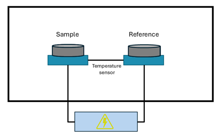
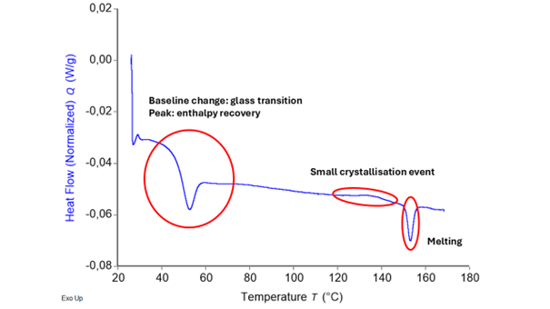

# mDSC_apps

## Overarching app

Welcome to the mDSC analysis software package. If you are not familiar with mDSC, 
we recommend you go to the section about theoretical background first, since the 
following will be technical. This package is intended to help you with:

1. **DSC descriptive statistics**: Quickly calculating averages, standard deviations, 
and relative standard deviations based on mDSC analyses performed in TRIOS®. Thus,
for using this app, your data must already be in specifically formatted Word tables 
and documents.  

2. **Quasi-Isothermal modulated DSC deconvolution**: this type of analysis is not 
always present in all DSC software packages (such as TRIOS®), hence the need for 
a user-friendly app to do this. The input required here is an Excel with your
raw modulated heat flow, modulated temperature, and time. 

3. **Regular modulated DSC deconvolution**: in software packages, this is done by 
using a rolling Fourier transform to extract the amplitude and average of the 
signal. However, in certain cases, this type of deconvolution can lead to artifacts.
This is why it is useful to also calculate the amplitude and average of the signal
based on the maxima and minima in the raw data, without using a Fourier transform.
Moreover, it might be useful to compare this data to unmodulated DSC data, as well
as modulated DSC data that was deconvoluted with a Fourier transform. This package
combines all these features. It package requires an Excel file containing 
temperature, time, and modulated heat flow. 

4. **Modulated DSC deconvolution simulation**: it might be interesting, based on 
events that are already known, to mathematically simulate deconvolution of 
modulated DSC thermograms. This app requires you to already have performed 
modulated DSC on a sample, since inputs such as onset temperatures, midpoint
temperatures, heat capacities, and enthalpies are required. The app uses this
data to construct a modulated heat flow signal, which is subsequently deconvoluted 
into the reversing, total and non-reversing heat flows.

## Theoretical background of DSC and mDSC

Since many parts of the different apps use the same theoretical foundations, a 
theoretical background is given here. It will be referred to as required in the 
different sub-apps.

### Differential scanning calorimetry (DSC)

Differential scanning calorimetry (DSC) is one of the most common methods to 
study the thermal properties of materials. It is of crucial importance in polymer
chemistry and physics, material science, pharmaceutical science, and so forth. 
It allows the user to characterize material properties such as glass transitions,
crystallization and melting events, solvent evaporation, degradation, or any other
detectable event that involves a change in enthalpy or heat capacity. 

A DSC experiment consists of heating two small pans (a pan weight of around 
20-30 mg is most common) from a given temperature to a given temperature at a 
certain heating rate. One of the pans is empty and is called the reference pan.
The other pan contains several milligrams of sample and is referred to as the 
sample pan. As both pans are heated by the furnace (blue blocks in *Figure 1*). 
transitions occur in the sample. This results in a temperature difference,
$\Delta T$ between the sample and reference pans. The total heat flow 
$\frac{dQ}{dt}$, which is the energy flowing to the sample per unit of time, can 
then be derived to be the following:\

Where R_r is a resistance term. This simple equation does not consider differences 
in heat capacity between the two furnaces, differences in heat capacity between 
the sample and reference pans, and other instrumental effects. Hence, equations 
that are used to calculate heat flow in DSC are generally more complex. Moreover, 
calibration is always necessary for all DSC instruments to correct for 
instrumental error. Nonetheless, the sample contribution is still fully contained 
in *Equation 1*.

**Figure 1.** Basic representation of a differential scanning calorimeter.

The result of a DSC run is a thermogram where heat flow, often normalized for 
sample mass, is generally plotted against temperature. From a thermogram, the
onset, peak (or midpoint in the case of glass transitions), and endset temperatures
of thermal events can be obtained. Moreover, integrating the area under the 
curve of a heat flow versus time (in seconds) thermogram results in the change 
in enthalpy associated with a certain event. An example of a thermogram 
containing a glass transition, an enthalpy recovery, a crystallization event,
and a melting event is shown in *Figure 2*. Further instructions on how to analyze 
and interpret thermograms are not included in this text.

**Figure 2.** Typical thermogram resulting from a differential scanning 
calorimetry experiment. Different thermal events are present and highlighted in 
the figure.

The value of the heat flow signal depends on the heating rate. Hence, sometimes, 
the heat capacity is plotted, since it is normalized for heating rate. The 
relationship between heat capacity ($C_p$) and heating rate ($\beta$) is as 
follows when exothermic events are plotted up:

The minus sign here is crucial and must be explained further. If a sample is 
giving off heat (for instance when it is crystallizing), the furnace supplies 
“negative power” and it would make sense for the heat flow to be negative. This
becomes all the more obvious when discussing this in terms of $C_p$. It is 
defined formally, meaning that there is no option for “peak up” or “peak down”. 
For example, there would be a downward $C_p$ peak during crystallization since 
the sample is giving off heat, and so it’s apparent $C_p$ is much lower. There 
is no real choice here when it comes to plotting peaks up or down. Since the 
definition of $C_p$ is clearly defined but $\frac{dQ}{dt}$ can be plotted with 
exotherms either up or down, a minus sign needs to be inserted as a bookkeeping 
quantity when exotherms are plotted up (or in other words, when endotherms are 
plotted down). This is why all thermograms normally mention whether exo is up or
exo is down. For this software package, “exo up” is used for everything going 
forward.

Now that the basics of DSC are clear, it is time to discuss the simple 
temperature program used in unmodulated DSC, since this will paint the picture
for the main differences between modulated (mDSC) and unmodulated DSC (still DSC).
For a DSC analysis, temperature ($T$) can be expressed as follows:

where *t* is the time, and *β* is the heating rate. Taking the derivative simply 

This is a very important difference when comparing to DSC and mDSC, where the
temperature program is more complex.