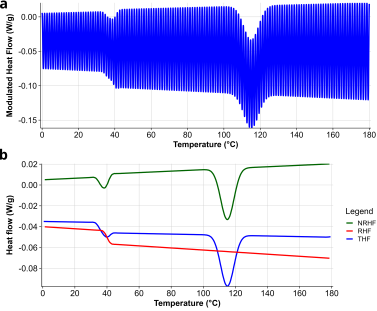

# Summary
The Advanced mDSC software package is a collection of four user-friendly RShiny apps that helps users without programming knowledge to decode their modulated differential scanning calorimetry (mDSC) data. Differential scanning calorimetry (DSC) is a thermal analysis technique that is commonly used in pharmaceutical and material science to detect the different transitions and thermal events undergone by a material when it is heated. mDSC is an improved version of DSC in the sense that it can be used to deconvolute different events, but it also presents additional complexity and technical difficulty. Moreover, the data generated using this method must be analyzed by computational methods, since it generally involves datasets with hundreds of thousands of datapoints. 

# Background
Differential scanning calorimetry (DSC) is one of the most common methods to study the thermal properties of materials. [@Knopp2016; @LeyvaPorras2019] It is of crucial importance in polymer chemistry and physics, material science, pharmaceutical science, and so forth. It allows the user to characterize material properties such as glass transitions, crystallization and melting events, solvent evaporation, degradation, or any other detectable event that involves a change in enthalpy or heat capacity. A significant upgrade with respect to unmodulated DSC is modulated DSC, which allows for deconvoluting different signals. Where unmodulated DSC uses a simple constant heating rate, mDSC superimposes a sinusoidal signal. Certain thermal events (such as glass transitions) can react to this faster heating rate, but others (such as most crystallisation events) can not, allowing the user to deconvolute the signal. [@Reading1993; @Rabel1999; @Royall1998; @Craig1998] The Advanced mDSC software package groups several sub-apps that help the user gain a better understanding not only of their mDSC data, but also of the technique in general. 

Despite the potential of mDSC, the technique has some limitations. Since the technique is more complex, blind interpretation of the results can be risky. A Fourier transform is generally used to deconvolute the data, but this can, in some cases, lead to artifacts in the deconvoluted signals. [@Schawe1998] Thus, the "Regular mDSC deconvolution" sub-app proposes alternatives to using a Fourier transformation to deconvolute the modulated heat flow. Furthermore, an important assumption in mDSC is the steady-state assumption, namely that the material is at complete equilibrium at any point during the heating procedure. However, this assumption is generally not met; since the material is being heated continuously and thermal events occur continuously, it is almost a given that the material is not in equilibrium. It is for this reason that the user might choose to perform a quasi-isothermal mDSC analysis, where only the sinusoidal temperature modulation is applied for extended periods of time at a fixed average temperature. [@Wunderlich2005] This results in complex analyses containing hundreds of thousands of data points. 

# Statement of need
The software presented here tackles the two problems presented above. First, the "Regular modulated DSC deconvolution" application offers different tools and methods for deconvoluting mDSC data, allowing the user to avoid performing a Fourier transform. Furthermore, the "Quasi-Isothermal modulated DSC deconvolution" app helps users to analyse complex quasi-isothermal mDSC data by performing automatic segmentation and heat capacity calculations.  

Additionally, it may be useful to predict the result of the deconvolution procedure when different sets of parameters are used. The "Modulated DSC deconvolution simulation" app helps with this. It is merely a mathematical tool (as opposed to a physical model) in the sense that it requires complete knowledge of the thermal events in a material, but it can predict what the deconvoluted signals will look like. This can be used to solve complex problems but can also be used as an educational "look under the hood" to see what really happens in an mDSC deconvolution procedure. 

Finally, TRIOS® by TA Instruments is a commonly used software package for the analysis of mDSC results. In order to speed up the analysis of data generated using TRIOS®, the "DSC descriptive statistics" app was included into the overall package as well. It simply combines several tables in an interactive manner, allowing the user to very quickly calculate averages, standard deviations, and relative standard deviations. 

All aforementioned applications are currently being used to fully understand elusive thermal behaviour of a polymer (more precisely, a polyoxazoline). All mDSC runs of this material have consistently produced an physically impossible exothermic peak in the reversing heat flow of resulting thermograms. This was first thought to be an artifact, but it was found to be highly reproducible, even when different parameters, thermal histories, and instruments were involved. This probed further investigation into whether there was an underlying mechanism. Indeed, the "Regular mDSC deconvolution" sub-app confirmed that it is not merely an artifact attributable to the Fourier transform that is normally used to deconvolute data, the "Quasi-isothermal mDSC deconvolution sub-app was used to study the material under quasi-isothermal conditions, and the "mDSC deconvolution simulation" sub-app was used to simulate the kind of signal that might give rise to the exothermic peak, which proved conclusively how the exothermic peak might arise from a series of small, precisely-timed, endo- or exothermic signals. Although this particular application is of course unique, the the different sub-apps can certainly be used for completely different problems as well. Indeed, the "mDSC deconvolution simulation" sub-app has since been used to quantify the well-known "frequency effect", whereby the different in glass transition midpoint locations on the total and reversing heat flows result in an artifact in the non-reversing heat flow. We are aware that some commercially available software is adapted for the analysis of quasi-isothermal data, but not all software packages include an efficient workflow for performing this type of analysis (TRIOS® for instance does not). The authors are unaware of commercial packages offering functionalities offered by the "Regular mDSC deconvolution" and "mDSC deconvolution simulation" sub-apps.

{width=0.1\textwidth}

{width=0.1\textwidth}

{width=0.1\textwidth}

# State of the field
We are confident that these applications will constitute an improvement when compared to the currently available software. There is commercial software available (TRIOS® by TA instruments, STARe® by Mettler-Toledo, Pyris® by PerkinElmer, and so forth), but these packages are not open source and a license is required to use them. Moreover, they do not necessarily offer the same capabilities as the Advanced mDSC software package. To the best of our knowledge, none of them offers an option comparable to the "Modulated DSC deconvolution simulation" app. Furthermore, quasi-isothermal mDSC data analysis might not be as user-friendly as the "Quasi-Isothermal modulated DSC deconvolution" app, requiring manual data segmentation rather than doing this automatically. The "DSC descriptive statistics" app was specifically built to cover a shortcoming of the TRIOS® software. Finally, it is not clear what the options are for these software packages when it comes to performing mDSC deconvolution without Fourier transform, but it is likely that it is not possible in some of them (it is impossible in TRIOS® for instance). Indeed, it is difficult to find out exactly what these packages can and can not do, since all require a license in order to install them. An open source alternative called pyDSC [@pyDSC] exists, but this focuses on integrating and correcting mDSC data, and thus the scope is not the same as the Advanced mDSC software package. 

# Software design
The software was designed to be accessible to users without programming experience while maintaining a modular architecture that facilitates future development. A graphical user interface was implemented using the Shiny [@shiny] framework, enabling users to upload data, perform analyses, visualize results, and export output through a browser-based workflow. Documentation is provided both within the application and in the GitHub repository, with guidance and mathematical background separated according to the four available modules. Indeed, the software consists of four functionally independent sub-applications whose interfaces are managed using the shiny.router package, as shown in @fig:architecture. This separation is reflected in the code structure, as each module maintains its own functions, dependencies, and analysis workflow. Such modularity simplifies maintenance and extension of the software because changes to a given module can generally be implemented without affecting the others.

{width=0.1\textwidth}

The software was developed in R, an open-source language with a large user community and extensive package ecosystem. The computational requirements of the implemented analyses are modest, making R a suitable platform while also facilitating community contributions. Key dependencies include shiny [@shiny] for the web interface, shiny.router [@shinyrouter] for navigation between modules, ggplot2 [@ggplot2] for data visualization, and plotly [@plotly] for interactive graphics.

All sub-apps aside from the "DSC descriptive statistics" sub-app focus on the deconvolution of the modulated heat flow present in raw mDSC data, obtained from different sources. These include regular mDSC, quasi-isothermal mDSC, and simulation of the modulated heat flow. The main technique for deconvoluting the signal is Fourier analysis, but the "Regular mDSC deconvolution app" also applies a different method based on neighbouring minima and maxima. The detailed mathematics used within the software package are described in the documentation, as it would be too extensive to give a full overview here. However, three equations are crucial for all applications and are thus mentioned here. When deconvoluting an mDSC signal (also called the modulated heat flow, MHF), this normally results in a total heat flow (THF), a reversing heat flow (RHF), and a non-reversing heat flow (NRHF). The equations used to calculate these three quantities are, respectively, 

$$THF = \langle MHF \rangle = \langle \frac{dQ}{dt} \rangle, $$ 

$$RHF = -\beta \frac{A_{MHF}}{\frac{2 \pi}{T}A_{Temp}}, $$ 

$$NRHF = THF-RHF, $$

where $\frac{dQ}{dt}$ is the modulated heat flow, $\beta$ is the underlying (constant) heating rate, $T$ is the period of the temperature modulation, and $A_{Temp}$ is the amplitude of the temperature modulation.

# Research impact statement
The software was initially developed in order to elucidate a physically unexplainable signal on the reversing heat flow when analysing a polymer from the polyoxazoline class, which required the use of all the apps present within the software. This research will be submitted to the Journal of Thermal Analysis and Calorimetry. This being said, the software's value lies in the fact that the four different apps can be used in other contexts as well. For instance, quasi-isothermal mDSC is a more widely used technique that requires software for data analysis [@Wunderlich2005]. The mDSC deconvolution simulator can be used to simulate certain thermal events and investigate them, as was done in the previously mentioned research. The app that deconvolutes mDSC data without performing a Fourier transform can be used to check the validity of a wide variety of mDSC analyses, especially when it comes to the question as to whether enough modulations were present over a thermal event. Furthermore, the software is not tied to any specific file format and requires Excel files to run analyses, which can always be exported using any commercial software. This makes the software compatible with mDSC systems used across research groups to solve any research question that requires advanced mDSC analysis.

# AI usage disclosure
No generative AI was used in the design, the mathematics (which are based on literature), the manuscript writing, the testing, and most of the code writing for the app. Some generative AI was used to speed up the writing of small blocks of code or to help find relevant documentation. 

# Acknowledgments
The authors would like to acknowledge the help from Els Verdonck (TA Instruments) and Guy Van Assche (Vrije Universiteit Brussel) for providing help with the theoretical background of the software. Additionally, this research was funded through an FWO grant (1SH0S24N). 

# References
